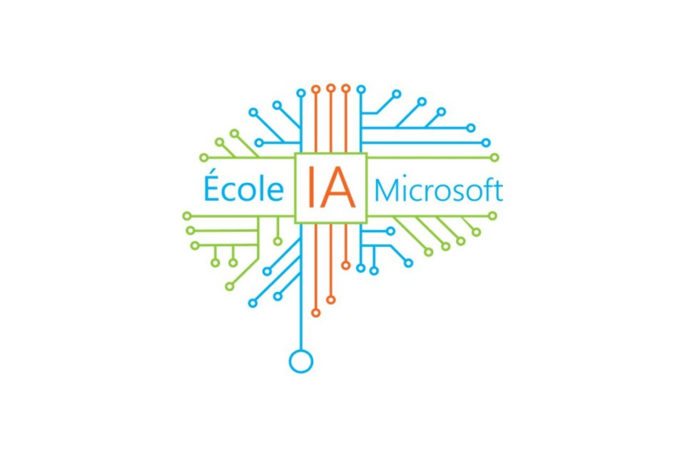

# POO x Bases de données : le stagiaire a fait des siennes
---
*Harold PETIARD*
### P1 - 2023
---

v1 - Ceci est la version initale du projet. 

#### Points d'amélioration : 

- entrée / sortie d'un patient plusieurs fois
- check if date_sortie > date_entrée, sinon annuler ou redemander une date 
- is_in_hospital ou working_at_hospital en fonction de la date du jour, car date_sortie peut etre dans le futur
- Interface dans le terminal (actuellement, toute l'interface est dans streamlit)

#### Dossiers : 

- **bdd** : contient le ficher sql pour importer la base de donnée
- **brief** : contient le brief et les notes du chef de service

---

A partir d'un code incomplet et mal écrit vous devez créer une application python en programmation orientée objet pour le service RH du CHU de Caen

## Contexte du projet

Vous venez d'intégrer le CHU de Caen dans le cadre d'un premier CDD en tant que développeur.se AI. Votre chef de service est très heureux de vous compter parmis ses nouveaux collaborateurs ! Mais malheureusement, l'ancien stagiaire est passé par là...

Il devait créer une application orientée objets en python afin d'enregister en base de données les entrées sorties des résidents de l'hopital et faciliter le quotidien des Ressources humaines. ...Mais son code ne fonctionne pas et sa base de données est inutilisable.

**Compostion de l'application et des classes** : voir l'annexe consigne des RH et du chef de service
​
### Corriger son code

I ) Vous devrez dans un premier temps corriger son code pour que vous puissiez lancer/run main_app.py depuis le dossier chu_app. Le stagiaire a probablement oublié des imports de modules et a surement fait des erreurs de syntaxe !

*Nb: Vous pouvez pour vous aider créer des methodes de test dans chaque module et appeler ces méthodes depuis main_app.py. Chaque methode pouvant par exemple retourner un string du type "Je fonctionne depuis ce module!"*

### Recréer une nouvelle base de données
​
II ) Ensuite vous allez recréer une nouvelle base de données que vous appellerez **"CHU_Caen"**, dans laquelle vous insérerez les tables suivantes

*Nb : N'hésitez pas à ajouter ou modifier des colonnes si vous jugez que cela est nécessaire*

#### ++Table1 : "patients"++

- identifiant_patient : varchar(200) Primary Key
- nom : varchar(200)
- prenom : varchar(200)
- groupe_sanguin : varchar(3)
- is_in_hospital : tinyint(1)

#### ++Table2 : "rh"++

- identifiant_rh : varchar(200) Primary Key
- nom : varchar(200)
- prenom : varchar(200)
- salaire : varchar(3)
- working_at_hospital : tinyint(1)

#### ++Table3 : "archives"++

- identifiant_resident : varchar(200) Primary Key
- date_entree : date
- date_sortie : date

### Lire les notes

III) Enfin vous lirez notes_chef_de_service.py puis notes_rh.txt

### Créer aléatoirement des patients et RH

IV) Pour finir vous allez générer aléatoirement des patients et rh en créant un nouveau module que vous appellerez fake_resident.py. Vous pourrez, par exemple, vous aider de la bibliothèque "random"

## Modalités pédagogiques

- Vous avez 48H si vous l'acceptez pour réaliser l'application (**jusqu'au 16/11/2024**).
- Travail à réaliser individuellement

## Critères de performance

La base de données et les tables sont opérationnelles.

L'application utilise la programmation orientée objet et fonctionne.

## Modalités d'évaluation

Correction en groupe + individuelle

## Livrables

Un fichier brief_01122022.zip contenant l'application chu_app

---

<picture>
  
</picture>

<picture>
  
</picture>

<picture>
  
</picture>